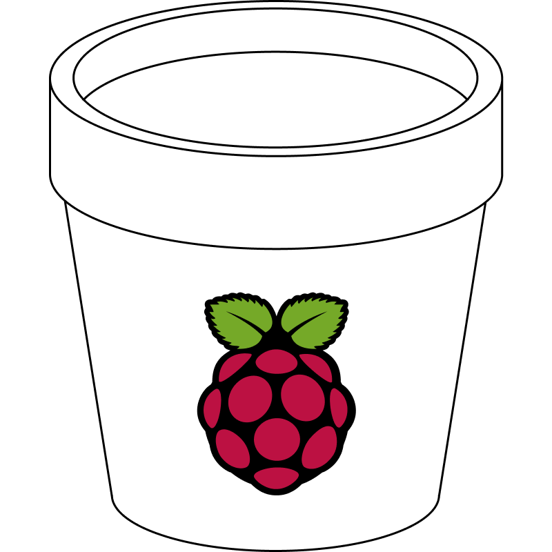

# 🪴 My Garden

Saw [this](https://www.reddit.com/r/interestingasfuck/comments/vkuhvk/time_lapse_of_a_pepper/) post on reddit and wanted to do it myself. But since my garding skills and reliability when it comes to plants are about **zero**, I wanted to automate that process.

## Requirements

-   [Raspberry Pi 3](https://www.raspberrypi.com/products/raspberry-pi-3-model-b/)
-   [Camera](https://www.amazon.de/gp/product/B07KSZW251)
-   [Waterpump and tubes](https://www.amazon.de/gp/product/B082PM8L6X)
-   [5V Relais](https://www.amazon.de/WayinTop-Trigger-Optokoppler-Arduino-Raspberry/dp/B07VYX5GK4)
-   SD card, dirt, seeds, case...

## Preparation

I installed Ubuntu Server on the Raspberry Pi to be able to run my node scripts - could have done this using a microcontroller but I am more familiar with linux and higher level programming languages so I used the Raspberry Pi which was laying around for years. Afterwards I installed the latest node version and was ready for scripting.

## ✍️ Scripts

### Waterpump

A CRON job in the script activates the waterpump twice a day at 8am and 7pm for a few seconds, which is enough for watering my garden. The interval and timespan of pumping has to be calibrated depending on the pump, type of seeds and size of the garden.

The script can be found [here](scripts/waterpump.js).

### Timelapse

The Raspberry Pi itself is capable of doing a timelapse using the `raspistill` command. But since I also wanted to store the images in a database, I automated this process of taking pictures using a node script. By default the script takes an image every 30 minutes, uploads it onto imgur and moves it afterwards to the [timelapse folder](/timelapse). You can adjust the intervals by editing the cron-job definition.

The script can be found [here](scripts/timelapse.js).

## 🛠 Setup

The setup is divided into several hardware and software specific steps...

### Installing the Raspberry Pi

1. Setup a Raspberry Pi (preferably with Ubuntu)
2. Install [node.js and npm](https://nodejs.org/en/) (can be done using [nvm](https://github.com/nvm-sh/nvm))
3. Connect and enable the camera using [this](https://www.raspberrypi.com/documentation/accessories/camera.html#re-enabling-the-legacy-stack) guide
4. Clone this repository onto your Pi and install dependencies in the scripts folder
    - `cd scripts && npm install`

### Setting up imgur

1. You will have to register an application [here](https://api.imgur.com/oauth2/addclient)
2. Open the following Link with your apps credentials in browser and grant access:
    - `https://api.imgur.com/oauth2/authorize?client_id=XXX&client_secret=XXX&response_type=token`
3. After getting redirected, extract your `access_token` and `refresh_token` from the browser url
4. Create a new album, open it and extract its ID from the browser url
    - **do not** set it publicly visible
5. Create a .env file in the root directory using `cp .env.template .env` and add your informations

### Wiring the Waterpump

To be able to control the waterpump using the Raspberry Pi you have to wire it correctly using the 5V relais, which was a bit tricky for me as a noobie to electronics at first but managed to get it running with a bit of help of a friend. The following text and image should help you get going...

1. Connect `Pin 2 (5V Power)` to one of the `relais DC` pins
2. Connect `Pin 6 (GND)` to the other one of the `relais DC` pins
3. Connect `Pin 11 (GPIO 17)` to the third `relais IN` pin
    - used to control the relais via scripts
4. Connect `Pin 4 (5V Power)` to `relais COM` pin
    - now on the otherside of the relais
5. Connect `Pin 9 (GND)` to one of the wires of the waterpump
6. Connect the other waterpump wire with the `relais NC` pin

By de-/activating the `GPIO 17` pin on the Raspberry Pi you are now able to switch the relais and with it the waterpump on and off.

## 🌐 Website

I wanted to provide a website where I can take a look at my plants whenever I want.

First I wanted the project to be selfcontained and not depend on external services, but that would have meant to run the website on the Raspberry Pi in my local network, do a port forwarding and dynamically update my external IP via dyndns... so to make it a bit easier I used the [imgur API](https://apidocs.imgur.com/) to upload, and host all the images. With this setup I am able to run the website publicly on the internet via Github Pages and access the timelapse images using the imgur API.

The website also uses the enviroment variables defined in the [.env file](.env.template) to access the images hosted on imgur. You can run the `npm run dev` command inside the `www folder` for an development server, which can be accessed via `localhost:8080`. More informations on how to use or run the website can be found [here](www/).

The website and the current state of my garden can be found [here](https://redii.github.io/garden).
